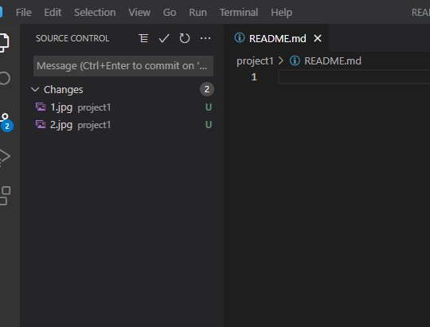

- I cloned the github repository inside of github desktop 

- These are me making changes to my project folder of readme

- If you press the dots on top of this screen shot you can push, pull, and commit by using the checkmark.

- This screenshot contains my local user with my private key and generated public and private key to give to my aws instance. To create my public and private keys I ran the command ssh -keygen -t ed25519 -C public1. 

- The screenshot above has my user git2 from my aws instance I created this by using command sudo adduser. Once I created that I had to make a directory called gaddis13 and run the command git init --bare proj1.git to create an empty repository. Using my public key I had access config in my git2 user and give it my public key file contents for my user to access and clone the repository. 

