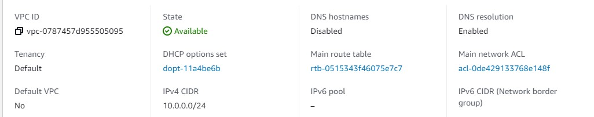
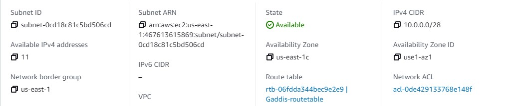
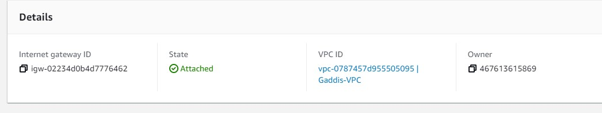
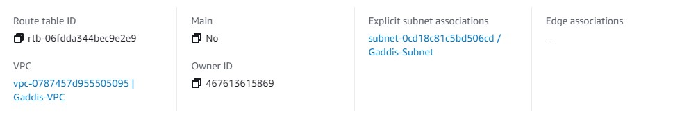
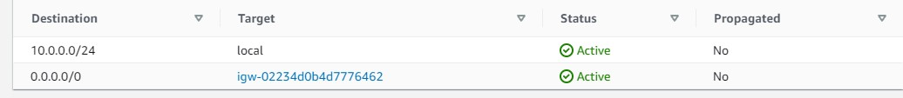
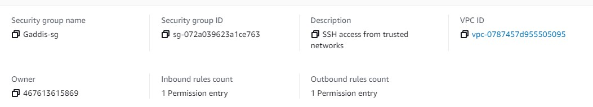
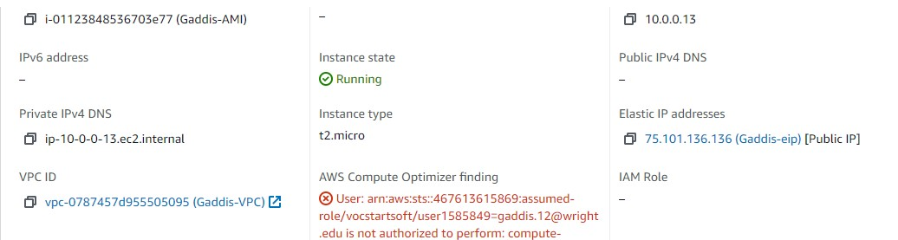
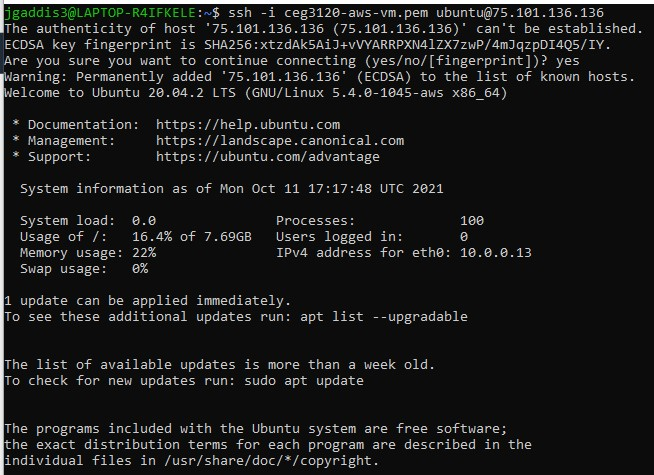

-Part 1

-Vpc is a environment contained within a public cloud that runs code store data host websites. 

-is the range of IP addresses in your vpc

-internet gateway allows communication between your vpc and internet. 

- A route table is used to determine where network traffic from your subnet or gateway

- Acts as a virtual firewall for your ec2 instance controls incoming and outgoing traffic. 

-Part 2

- AMI selected was the ubuntu 
- Instance type t2.micro
- To attach vpc to instance go to network on step 3 and attach it. 
- Nay to auto assign public ip because you can expose the instance
- Step 4 keep everything default at 8gb and general purpose to attach storage volume. 
- Click add tag to create a name with Gaddis-Instance
- To associate vpc with security group search your vpc in basic details of security group. 
- Click actions on elastic ip once it's created and associate your vpc to the elastic ip. 