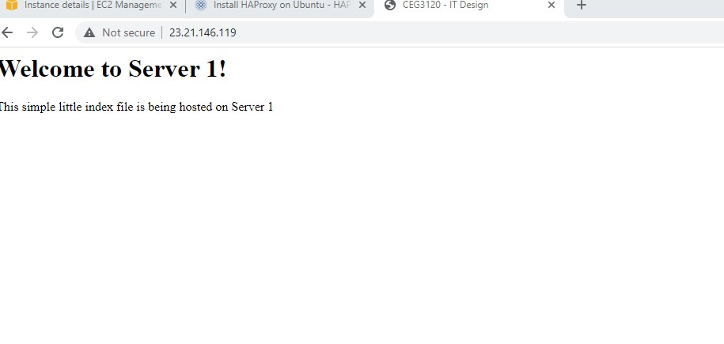
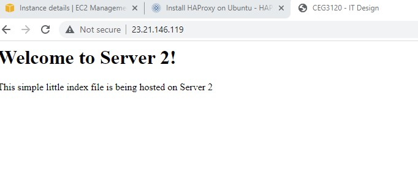

- 1 - To create etc/hosts you first create the host file in the etc location and to configure it you use vim to put the private ips and their hostnames. 
- 2 - To ssh between instances you have to make sure the private key is on at least one of the servers then use command: ssh -i .ssh/ceg3120-aws-vm.pem ubuntu@webserv1
- 3 - To install haproxy : sudo apt install haproxy. The file that is modified and it's location is /etc/haproxy/haproxy.cfg. The configurations were to get the front and backend to listen to port 80 for web browser connection for index.html page on my different web server tied to their private IP. To restart you use sudo systemctl stop haproxy.service and sudo systemctl start haproxy.service. Website used was https://www.haproxy.com/blog/the-four-essential-sections-of-an-haproxy-configuration/. 
- 4 - To install apache you use command sudo apt-get install -y apache2 and change hostname using command: sudo hostnamectl set-hostname webserv1. The files that were configured and their location /etc/www/html/. I had to download the html file I needed and replace the index.html to become my webpage. I used sudo reboot to restart my service after configuration. Website used : https://www.digitalocean.com/community/tutorials/how-to-install-the-apache-web-server-on-ubuntu-20-04. 
- 5 -  
- 